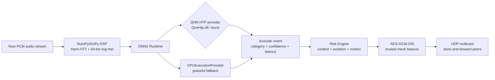

# AegisEdge — Zero-Cloud Tactical Edge Acoustic Surveillance on Snapdragon X Hexagon NPU

AegisEdge is an on-device acoustic threat detection reference implementation for Snapdragon-class Windows on ARM64 systems. It turns raw PCM into a compact log-mel spectrogram, runs a quantized ONNX classifier through Qualcomm's QNN HTP execution provider when available, scores contextual risk locally, and relays only encrypted telemetry over a local mesh.

## Problem & Why On-Device Snapdragon

Cloud acoustic monitoring is unavailable exactly when connectivity is disrupted, and its round trip adds latency to mission-critical alerts. AegisEdge keeps detection, risk scoring, and first-hop relay local so it can continue operating without internet access.

The Hexagon NPU is designed for efficient always-on inference. The project target is less than 2 W for the NPU path versus an illustrative 18 W CPU/dGPU background-listening budget on HP Omnibook-class PCs; these are system-design targets, not measurements from this repository. Local AES-GCM-256 encryption protects threat telemetry before it reaches a neighboring node.

## System Architecture



## Repository Layout

- `main.py`: Rich console commands and end-to-end demonstration.
- `src/acoustic_monitor.py`: streaming PCM buffer, pure NumPy/SciPy log-mel features, QNN-first ONNX inference.
- `src/risk_engine.py`: contextual threat scoring and level transitions.
- `src/mesh_beacon.py`: AES-GCM-256 encrypted UDP multicast and in-memory offline queue.
- `src/snapdragon_profiler.py`: QNN/CPU verification, p50/p95 latency, and throughput measurements.
- `docs/AEGISEDGE_SPEC.md`: system design and threat matrix.

## Quickstart

Use Python 3.10+ in a virtual environment. On Windows ARM64, install an ONNX Runtime build that exposes the QNN execution provider and place the required QNN runtime libraries, including `QnnHtp.dll`, on the DLL search path.

```bash
python -m venv .venv
# Windows: .venv\Scripts\activate
# Linux/macOS: source .venv/bin/activate
python -m pip install -r requirements.txt
```

Point the application at a quantized static-shape acoustic model:

```bash
set AEGSEDGE_ACOUSTIC_MODEL=models\acoustic_event_classifier_int8.onnx
# PowerShell: $env:AEGSEDGE_ACOUSTIC_MODEL = "models\acoustic_event_classifier_int8.onnx"
```

The expected model input is `(1, 1, 64, 188)` float32 log-mel data. The application automatically falls back to `CPUExecutionProvider` if the model, QNN provider, or HTP driver is unavailable.

## Judge Verification

Run the deterministic synthetic demonstration:

```bash
python main.py simulate
```

This injects broken-glass, siren, and distress-call fixtures and displays the pipeline as `Audio Spectrogram -> Hexagon NPU/CPU -> Risk Engine -> Encrypted Mesh Broadcast`. Critical events are encrypted and decoded by a trusted local listener; no internet service is required.

Run the live Rich dashboard:

```bash
python main.py live
```

The live view shows acoustic listening state, threat level, active provider, latency, recent event log, mesh peers, and queued alerts. The current default stream is a mock PCM fallback; a device-specific `sounddevice` capture adapter can replace it without changing the classifier API.

Compare providers and inspect rolling telemetry:

```bash
python main.py benchmark
```

The benchmark prints whether `QNNExecutionProvider` was verified, the configured `QnnHtp.dll` backend, p50/p95 inference latency, and inferences per second for QNN and CPU. Missing model or hardware support is reported as a fallback note instead of stopping the demonstration.

## Development Notes

- Raw audio is processed in volatile memory and is not persisted by the application.
- Mesh payloads use a shared 32-byte AES-GCM key; production deployments should provision that key through the platform's secure storage rather than generating it at process startup.
- `qai-hub` is included for development-time compilation and profiling workflows, not required for the local simulator.
